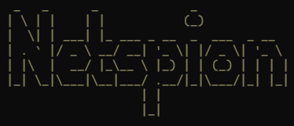

# This project is still in development

  
**Netspion** is a tool with useful pre-defined techniques for ethical hacking, it recopiles and adapt various of the most famous applications for hacking and pen-testing.

Techniques included:  
- Information Gathering
- Active Directory hacking
- Web Hacking
- Wifi Hacking
- Evasion techniques
- Post exploitation
  
> [!NOTE]
> You can run custom commands directly in the shell inside **Netspion**.

> [!IMPORTANT]
> **Python 3.10+ required**  
> You must install all the requirements to run the scripts without errors.  
``` pip install -r requirements.txt ```  

> [!IMPORTANT]
> Tools used and required (all credits to respective owners):
> - [Metasploit](https://www.metasploit.com/)
> - [SQLMap](https://sqlmap.org/)
> - [Nmap](https://nmap.org)
> - [Aircrack-ng](https://www.aircrack-ng.org)
> - [TheHarvester](https://github.com/laramies/theHarvester)
> - [Hashcat](https://hashcat.net/hashcat/)
> - [JohnTheRipper](https://www.openwall.com/john/)
> - Whois / Nslookup / DIG
> - [Lighttpd](https://www.lighttpd.net/)
> - [Impacket](https://github.com/fortra/impacket)
> - [Responder](https://github.com/lgandx/Responder)
> - [Subfinder](https://github.com/projectdiscovery/subfinder)
> - [WhatWeb](https://github.com/urbanadventurer/WhatWeb)
> - [GoBuster](https://github.com/OJ/gobuster)
> - [Ffuf](https://github.com/ffuf/ffuf)
> - [Commix](https://github.com/commixproject/commix)
> - [Wafw00f](https://github.com/EnableSecurity/wafw00f)
> - [LoadBalancing detector](https://github.com/craig/ge.mine.nu/blob/master/lbd/lbd.sh)
> - [Git Leaks](https://github.com/gitleaks/gitleaks)

> [!TIP]
> Recommended additional tools/websites (all credits to respective owners):
> - [Maltego](https://www.maltego.com/)
> - [Burpsuite](https://portswigger.net/burp/communitydownload)
> - [Nessus](https://www.tenable.com/products/nessus/nessus-essentials)
> - [Fluxion](https://github.com/FluxionNetwork/fluxion)
> - [Bloodhound](https://github.com/SpecterOps/BloodHound)
> - [SysInternals](https://learn.microsoft.com/en-us/sysinternals/downloads/)
> - [Mimikatz](https://github.com/ParrotSec/mimikatz)
> - [Rubeus](https://github.com/GhostPack/Rubeus)
> - [Covenant](https://github.com/cobbr/Covenant)
> - [SecList](https://github.com/danielmiessler/SecLists)
> - [OWASP ZAProxy](https://github.com/zaproxy/zaproxy)
> - [Nikto](https://github.com/sullo/nikto)
> - [Nuclei](https://github.com/projectdiscovery/nuclei)
> - [The Fat Rat](https://github.com/screetsec/TheFatRat)
> - [Local Tunnel](https://github.com/localtunnel/localtunnel)
> - [Waf-Bypass](https://waf-bypass.com/)